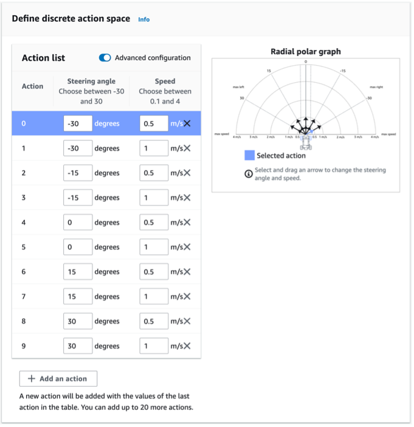
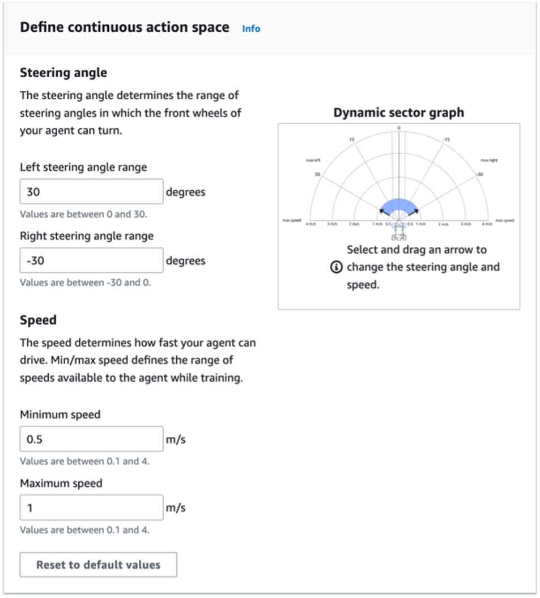
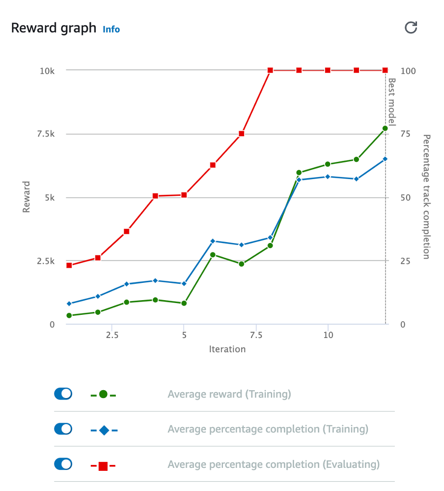
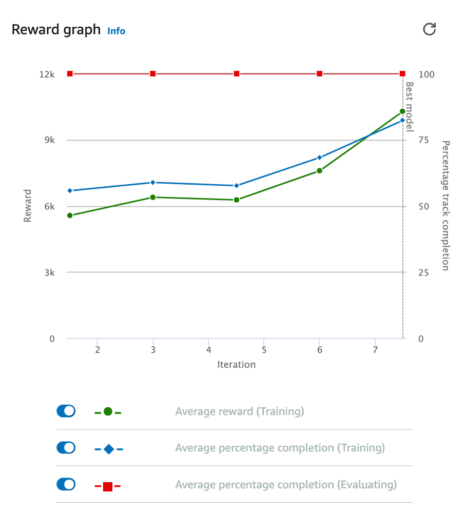
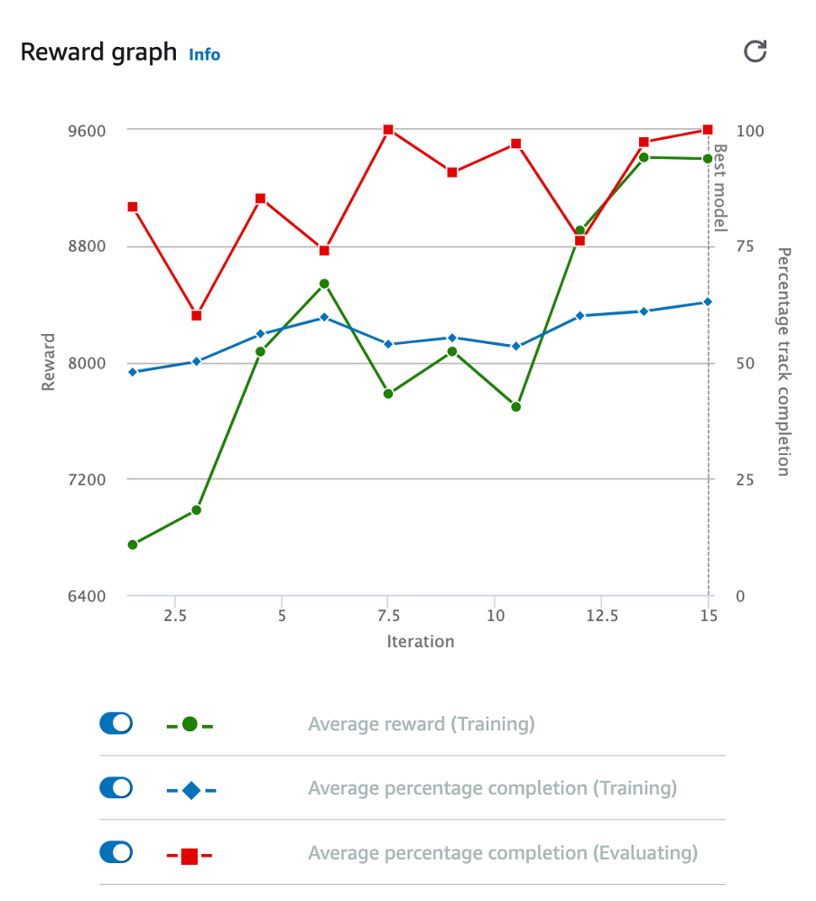

# DeepRacer

## Recommendations

### Recommendation 1: Choose your action space wisely.

Choosing the action space is crucial because it determines the available speed and steering angle for the agent. Once the model is trained, the action space cannot be changed even if you clone it. There are two types of action spaces: discrete and continuous.

In a discrete action space, you can select a set of choices for speed and steering. You can decide how many actions you want, and for each angle, you can adjust the speed. For example, you can set the speed of the agent to 1m/s if the steering angle is 15 degrees. On the other hand, in a continuous action space, the agent learns to select the best speed and steering values from the ranges you set. Instead of limited choices, the agent can pick any value within specified ranges. For instance, it could choose a steering angle between -30 and +30 degrees and an acceleration value between 1.2m/s and 2.4m/s.

I am using the continuous action space because it allows the agent to make small adjustments and achieve smoother driving on the track. However, it faces challenges in finding the right balance between speed and control. To get better results, I recommend training it for more than an hour. Since there are no fixed choices, the agent needs to explore and experiment with various values within the specified ranges.

  
   

### Recommendation 2: Prioritize Lap Completion over Speed

I recommend prioritizing lap completion over speed initially in your DeepRacer model. Instead of chasing maximum speed, focus on completing laps smoothly and efficiently to allow the agent to learn the track's layout and optimal racing line. Once your agent performs well on the track, you can gradually increase the speed of the agent when you clone them.

### Recommendation 3: Use relevant parameters for your training target.

If your current model training prioritizes keeping the agent on track at all times, consider minimizing or eliminating parameters that are unrelated to that goal. For instance, you can remove the "speed" parameter or reduce the penalty associated with it. Instead, place more emphasis on the "all_wheels_on_track" parameter when training to ensure the agent stays on track consistently. By focusing on relevant parameters, you can better align your training target with the desired behaviour of the agent.

### Recommendation 4: Modifying Hyperparameters When Cloning Your Model

When you clone your DeepRacer model, consider adjusting its hyperparameters. These settings affect how the model learns and drives. My recommendation is to lower the learning rate and increase the training time each time you clone the model. Additionally, try increasing the batch size and the number of training episodes. These changes can help your cloned model learn better and improve its driving performance on the track. However, you need to consider how each clone models perform in the evaluation and physical track when changing the hyperparameter.

### Recommendation 5: Organise Your Model Naming Convention

When it comes to naming your models, it’s important to do it systematically. Since you’ll be training multiple models and each model with have its own set of clones with different tunings, having a clear naming convention is highly recommended. This allows you to easily keep track of each model’s performance and its associated parameters. For instance, I use a naming convention based on “Version.” The initial model is named “Version1,” and its clones are labelled as “Version1-1,” Version1-2”, and so on. This way, when a particular model or clone performs well, you can quickly identify the reward function, hyperparameters, and other settings used in that specific model iteration. This organised naming system simplifies your management and analysis of different models throughout your training process.

### Recommendation 6: Test All Your Model in Physical Track

During the evaluation phase, you can observe how your model performs within the simulated environment. Some models might navigate flawlessly in simulation, while others might go off the track several times. Based on these evaluation outcomes, you will most likely be selecting models that performed well in the simulated environment for physical track testing. However, I recommend that you test all your models on the physical track, regardless of their simulated performance. This is crucial because certain models that struggle in the simulated environment might surprise you by performing well on the physical track. This might happen due to different conditions and elements present in the physical environment. So, it is a good idea to give every model a chance on the real track to truly see how they perform and make more informed decisions.

## Model 1

### Hyperparameter Selection and Time

| Hyperparameter and time | Initial | Clone 1 | Clone 2 |
| ----------------------- | ------- | ------- | ------- |
| Gradient descent batch size | 64 | 128 | 128 |
| Entropy | 0.01 | 0.01 | 0.01 |
| Discount factor | 0.999 | 0.999 | 0.999 |
| Learning rate | 0.0003 | 0.0001 | 0.0001 |
| Number of experience episodes between each policy-updating iteration | 20 | 30 | 30 |
| Number of epochs | 10 | 10 | 10 |
| Time (mins) | 90 | 90 | 120 |
| Min Speed (m/s) | 0.5 | 0.5 | 1.25 |
| Max Speed (m/s) | 2.0| 2.4 | 2.8 |

## Training Reward Graph

  
   
   

